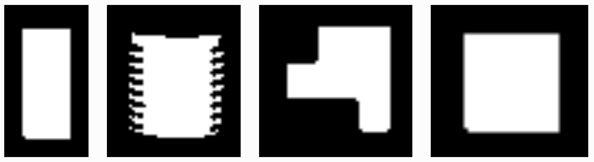

.. _TUTORIAL_PART_DETECTOR:

============================================
Tutorial PD: Use RGB Cameras to Detect Parts
============================================

.. admonition:: Tutorial PD
  :class: attention
  :name: tutorial_part_detector

  - **Prerequisites:** :ref:`Introduction to Tutorials <TUTORIALS>`, sensors adding and reading, python package creation,
  - **Source Code**: `https://github.com/jaybrecht/ariac_tutorials/tree/tutorial_part_detector <https://github.com/**INSERT**>`_ 
  - **Switch Branch**:

    .. code-block:: bash
        
            cd ~/ariac_ws/src/ariac_tutorials
            git switch tutorial_part_detector

This tutorial shows you how to extract information such as the part type, 
colour and pose from images produced by RBG cameras in the ARIAC environment. 
A flexible framework for part detection is presented here, but is only one 
approach of the many that are possible. For example, the image processing
block can be replaced with a different implementation for better results.

The solution provided runs an independent ROS2 node that detects parts and
publishes results on a user defined topic, essentially a user implementation
of the Advance Logical Camera.

This tutorial covers the following topics:
  - Reading RGB Camera Data
  - Using OpenCV within ROS2
  - Publishing Data that works with ROS2 Transforms

====
TODO
====
Mention:
#. competitor_pkg , sensor_config in ariac launch
#. platform: opencv version 4.2, 4.5.4 tested
#. need to start competition (service call) to start sensor publishing
#. Section: Imports, Class Variables, Instance Variables, Instance Methods

Package Structure
=================

.. code-block:: text
    :class: no-copybutton

    part_detector/
    ├── CMakeLists.txt
    ├── package.xml
    ├── config
    │   └── sensors.yaml
    ├── msg
    │   └── PartDetector.msg
    ├── part_detector
    │   └── __init__.py
    ├── nodes
    │   └── part_detector.py
    └── part_detector_assets
        ├── battery.png
        ├── pump.png
        ├── regulator.png
        └── sensor.png

Part Detector Class
===================
TODO

.. code-block:: python
    :caption: :file:`part_detector.py`
    :name: part_detector_tutorialPD

    #!/usr//bin/python3

    import rclpy
    from rclpy.node import Node
    from ariac_msgs.msg import AdvancedLogicalCameraImage as AdvancedLogicalCameraImageMsg
    from rclpy.qos import qos_profile_sensor_data
    from sensor_msgs.msg import Image as ImageMsg
    from geometry_msgs.msg import Pose
    import cv2
    from cv_bridge import CvBridge, CvBridgeError
    import numpy as np
    from imutils.object_detection import non_max_suppression
    from part_detector_msgs.msg import PartDetector as PartDetectorMsg
    from ariac_msgs.msg import PartPose, Part

    from timeit import default_timer as timer

    class PartDetector(Node):

        HSVcolors = {
            "red"    : {"hmin":   0, "smin":  10, "vmin": 115, "hmax":   4, "smax": 255, "vmax": 255},
            "green"  : {"hmin":  57, "smin":   0, "vmin":  85, "hmax":  65, "smax": 255, "vmax": 255},
            "blue"   : {"hmin": 116, "smin":   0, "vmin": 134, "hmax": 121, "smax": 255, "vmax": 255},
            "orange" : {"hmin":  14, "smin":   0, "vmin": 200, "hmax":  21, "smax": 255, "vmax": 255},
            "purple" : {"hmin": 130, "smin": 180, "vmin": 160, "hmax": 150, "smax": 255, "vmax": 255}
        }

        # BGR
        colors = {
            "red"    : (  0,   0, 255),
            "green"  : (  0, 255,   0),
            "blue"   : (255,   0,   0),
            "orange" : (100, 100, 255),
            "purple" : (255,   0, 100)
        }

        part_poses = {
            "red"    : {"battery": [], "pump": [], "sensor": [], "regulator": []},
            "green"  : {"battery": [], "pump": [], "sensor": [], "regulator": []},
            "blue"   : {"battery": [], "pump": [], "sensor": [], "regulator": []},
            "orange" : {"battery": [], "pump": [], "sensor": [], "regulator": []},
            "purple" : {"battery": [], "pump": [], "sensor": [], "regulator": []}
        }
        
        part_poses_translated = {
            "red"    : {"battery": [], "pump": [], "sensor": [], "regulator": []},
            "green"  : {"battery": [], "pump": [], "sensor": [], "regulator": []},
            "blue"   : {"battery": [], "pump": [], "sensor": [], "regulator": []},
            "orange" : {"battery": [], "pump": [], "sensor": [], "regulator": []},
            "purple" : {"battery": [], "pump": [], "sensor": [], "regulator": []}
        }

        colorType = {
            "red": Part.RED,
            "green": Part.GREEN,
            "blue": Part.BLUE,
            "orange": Part.ORANGE,
            "purple": Part.PURPLE,
            "battery": Part.BATTERY,
            "pump": Part.PUMP,
            "sensor": Part.SENSOR,
            "regulator": Part.REGULATOR
        }

        def __init__(self):
            super().__init__("PartDetector")

            self.bridge = CvBridge()

            if not self.load_part_templates():
                self.get_logger().info("part templates missing")

            self._left_bins_rgb_camera_subscriber = self.create_subscription(
                ImageMsg,
                "/ariac/sensors/left_bins_rgb_camera/rgb_image",
                self._left_bins_rgb_camera_callback,
                qos_profile_sensor_data
            )    

            self._left_bins_rgb_camera_publisher = self.create_publisher(
                PartDetectorMsg,
                "/ariac/sensors/left_bins_rgb_camera/part_poses",
                10
            )

        def _left_bins_rgb_camera_callback(self, msg: ImageMsg):
        
            # collect camera image
            try:
                cv_image = self.bridge.imgmsg_to_cv2(msg, "bgr8")
            except CvBridgeError as e:
                print(e)

            # process image, output parts in image coordinates
            self.find_parts(cv_image)

            # transform and publish found parts to a topic
            self.publish_part_poses(cv_image)

        def find_parts(self, img):
            '''
            image processing
            ''' 
            # hsv masking
            imgHSV = cv2.cvtColor(img, cv2.COLOR_BGR2HSV)

            for color in self.part_poses.keys():
                for type in self.part_poses[color].keys():

                    # colour filtering
                    imgMask = cv2.inRange(imgHSV, 
                                        self.colorBound(color, "lower"), 
                                        self.colorBound(color, "upper"))

                    # template matching
                    self.matchTemplate(imgMask, color, type)

                    # display bounding boxes
                    if len(self.part_poses[color][type]):
                        # sx, sy -> top left corner
                        # ex, ey -> bottom right corner
                        for (sx, sy, ex, ey) in self.part_poses[color][type]:
                            cv2.rectangle(img, (sx, sy), (ex, ey), self.colors[color], 3)
        
        def matchTemplate(self, imgMask, color, type):
            # template matching
            if type == "pump":
                tH, tW = self.pump_template.shape#[:2]
                matchField = cv2.matchTemplate(imgMask, self.pump_template, cv2.TM_CCOEFF_NORMED)
            elif type == "battery":
                tH, tW = self.battery_template.shape#[:2]
                matchField = cv2.matchTemplate(imgMask, self.battery_template, cv2.TM_CCOEFF_NORMED)
            elif type == "sensor":
                tH, tW = self.sensor_template.shape#[:2]
                matchField = cv2.matchTemplate(imgMask, self.sensor_template, cv2.TM_CCOEFF_NORMED)
            elif type == "regulator":
                tH, tW = self.regulator_template.shape#[:2]
                matchField = cv2.matchTemplate(imgMask, self.regulator_template, cv2.TM_CCOEFF_NORMED)

            # match many
            (yy, xx) = np.where(matchField >= 0.90)

            raw_matches = []
            for (x, y) in zip(xx, yy):
                raw_matches.append((x, y, x+tW, y+tH))

            # non-max suppression
            refined_matches = []
            refined_matches = non_max_suppression(np.array(raw_matches))

            self.part_poses[color][type] = refined_matches

        def publish_part_poses(self, img):
            # transform
            # 1. make output message structure

            msgOut = PartDetectorMsg()

            for color, parts in self.part_poses.items():
                for type, part_list in parts.items():
                    if type == "pump":
                        tH, tW = self.pump_template.shape
                    elif type == "battery":
                        tH, tW = self.battery_template.shape
                    elif type == "sensor":
                        tH, tW = self.sensor_template.shape
                    elif type == "regulator":
                        tH, tW = self.regulator_template.shape
                    

                    # changing part image coordinage to 3d coordinate
                    # for part_ic in part_list:
                    # find part center

                    # image (y) height = 480px
                    # image (x) width  = 640px
                    
                    # camera fov height = 1.4101928m
                    # camera fov width  = 1.8771005m

                    for sx, sy, _, _ in part_list:
                        p = PartPose()
                        p.part.color = self.colorType[color]
                        p.part.type = self.colorType[type]
                        p.pose.position.x = 0.0 # distance from camera to center of part on bin
                        p.pose.position.y = ((-(sx + tW // 2) + 320) / 640) * 1.8771005 # image x coordinate mapped to simulation distances
                        p.pose.position.z = ((-(sy + tH // 2) + 240) / 480) * 1.4101928 # image y coordinate mapped to simulation distances
                        p.pose.orientation.x = 0.0 # nope
                        p.pose.orientation.y = 0.0 # nope
                        p.pose.orientation.z = 0.0 # nope
                        p.pose.orientation.w = 1.0 # constant
                        msgOut.part_poses.append(p)

            self._left_bins_rgb_camera_publisher.publish(msgOut)

        # Helper functions
        def colorBound(self, color, bound):
            if bound == "lower":
                return np.array([self.HSVcolors[color]["hmin"],
                                self.HSVcolors[color]["smin"],
                                self.HSVcolors[color]["vmin"]])
            # elif bound == "upper":
            return np.array([self.HSVcolors[color]["hmax"],
                            self.HSVcolors[color]["smax"],
                            self.HSVcolors[color]["vmax"]])

        def load_part_templates(self):
            self.sensor_template = cv2.imread(
                "install/part_detector/share/part_detector/part_detector_assets/sensor.png", cv2.IMREAD_GRAYSCALE)
            self.regulator_template = cv2.imread(
                "install/part_detector/share/part_detector/part_detector_assets/regulator.png", cv2.IMREAD_GRAYSCALE)
            self.battery_template = cv2.imread(
                "install/part_detector/share/part_detector/part_detector_assets/battery.png", cv2.IMREAD_GRAYSCALE)
            self.pump_template = cv2.imread(
                "install/part_detector/share/part_detector/part_detector_assets/pump.png", cv2.IMREAD_GRAYSCALE)

            if (not self.sensor_template.shape[0] > 0) or \
            (not self.regulator_template.shape[0] > 0) or \
            (not self.battery_template.shape[0] > 0) or \
            (not self.pump_template.shape[0] > 0):
                return False
            return True

    # ooo        ooooo       .o.       ooooo ooooo      ooo 
    # `88.       .888'      .888.      `888' `888b.     `8' 
    #  888b     d'888      .8"888.      888   8 `88b.    8  
    #  8 Y88. .P  888     .8' `888.     888   8   `88b.  8  
    #  8  `888'   888    .88ooo8888.    888   8     `88b.8  
    #  8    Y     888   .8'     `888.   888   8       `888  
    # o8o        o888o o88o     o8888o o888o o8o        `8  
        
    if __name__ == "__main__":
        rclpy.init(args=None)
        part_detector_node = PartDetector()
        while rclpy.ok():
            try:
                rclpy.spin_once(part_detector_node)

            except KeyboardInterrupt:
                break

        part_detector_node.destroy_node()
        rclpy.shutdown()

Code Explanation (Python)
^^^^^^^^^^^^^^^^^^^^^^^^^

- Imports:

    ...

- Class Variables

    ...

- Instance Variables

    ...

- Instance Methods

    ...

Camera Subscription
-------------------
The RBG and RGBD cameras - through the use of plugins - publish data to 
multiple topics. The topic with the image matrix is 
:python:`/ariac/sensors/<SENSOR_NAME>/rgb_image`. Notice the QoS profile 
setting. The value of this arguement is an import starting point for 
troubleshooting when your subscriber appears to not receive data.

.. code-block:: python

  self._left_bins_rgb_camera_subscriber = self.create_subscription(
    ImageMsg,
    "/ariac/sensors/left_bins_rgb_camera/rgb_image",
    self._left_bins_rgb_camera_callback,
    qos_profile_sensor_data
  )  

Collecting and Handling Image Data
----------------------------------
Camera images from sensor topics are in a ROS message format and are not 
compatible with OpenCV Matrix types. The ROS2 :python:`cv_bridge` package 
allows for efficient conversion between image messages and OpenCV matrices.

.. code-block:: python

    self.bridge = CvBridge()

The first step is to read in an image frame. This is done  with the 
:python:`imgmsg_to_cv2` function takes in the image message content and the 
output image encoding. :python:`bgr8` is the canonical OpenCV format. It is 
important to specify this because the default image encoding from the camera 
is :python:`rgb8`. 
The second step is to find parts within the image. This stage should return 
the colour, type and position of each part in the image's frame. 
The :python:`find_parts` function does this, but does not return anything 
because it updates a member attribute that stores part information. The 
details of the image processing is discussed in subsequent sections.
The third step is to transform part locations in the 2D image frame into more 
usable 3D coordinates in the camera's frame so that they are compatible with 
the ROS2 Transform system.

.. code-block:: python

    def _left_bins_rgb_camera_callback(self, msg: ImageMsg):

        # collect camera image
        try:
            cv_image = self.bridge.imgmsg_to_cv2(msg, "bgr8")
        except CvBridgeError as e:
            print(e)

        self.find_parts(cv_image)

        # publish 

.. .. figure:: ../images/tutorial_part_detector/rubber_duck.jpg
..     :scale: 50% 
..     :align: center

    Fig: Gazebo View

.. figure:: ../images/tutorial_part_detector/camera_view.png
    :height: 400px
    :align: center

    Fig: Camera View

Image Processing
----------------
The goal of this part of the program is to take in an RGB camera image and 
return a list of parts in the image. The parts should be identified by colour, 
type and location within the image. The following sequence, implemented as 
:python:`find_parts`, shows one way to do this:

- HSV Colour Masking
- Template Matching (Cross Correlation)
- Non-Maximum Suppression

There are 5 possible part colours and 4 possible part types. Parts are found 
by inspecting the image once for each colour-type combination. First, the 
image is changed from the BGR to HSV colour space to gain some degree of lighting 
invariance. To pick out parts of a chosen colour, predetermined upper and 
lower bounds of the HSV values for the colour are specified to 
the :python:`cv2.inRange` function which masks out everything but the parts of 
that colour. The colour bounds are chosen such that only the tops of the parts
are unmasked which is necessary for next step.

.. code-block:: python

    # HSV conversion
    imgHSV = cv2.cvtColor(img, cv2.COLOR_BGR2HSV)

    for color in self.part_poses.keys():
        for type in self.part_poses[color].keys():

            # colour filtering
            imgMask = cv2.inRange(imgHSV, 
                                self.colorBound(color, "lower"), 
                                self.colorBound(color, "upper"))

These values can be emperically determined. If you don't want to build your own, this 
online tool can help with tuning HSV values: `Online HSV Mask Tool <https://pseudopencv.site/utilities/hsvcolormask/>`_.

.. code-block:: python

    HSVcolors = {
    "red"    : {"hmin":   0, "smin":  10, "vmin": 115, "hmax":   4, "smax": 255, "vmax": 255},
    "green"  : {"hmin":  57, "smin":   0, "vmin":   0, "hmax":  80, "smax": 255, "vmax": 255},
    "blue"   : {"hmin": 116, "smin":   0, "vmin": 134, "hmax": 121, "smax": 255, "vmax": 255},
    "orange" : {"hmin":  14, "smin":   0, "vmin": 200, "hmax":  21, "smax": 255, "vmax": 255},
    "purple" : {"hmin": 130, "smin": 180, "vmin": 160, "hmax": 150, "smax": 255, "vmax": 255}
    }

    Fig: Image Masking (Blue Parts)

The second step is to find the types of parts in the masked image. This is done 
by taking an image of a known part as template and searching the masked image 
for places that match the template. Since the image is an 8-bit 
single channel masked image, the template of the part needs to be in the same 
format. These images can be created and stored off-line since part appearences
are not subject to change. This code snipped shows how the images are loaded when the node is initialized. Missing templates will stop normal operation.

.. code-block:: python

  def load_part_templates(self):
    self.sensor_template = cv2.imread(
        "install/part_detector/share/part_detector/part_detector_assets/partTemplateMasks/sensor.png", cv2.IMREAD_GRAYSCALE)
    self.regulator_template = cv2.imread(
        "install/part_detector/share/part_detector/part_detector_assets/partTemplateMasks/regulator.png", cv2.IMREAD_GRAYSCALE)
    self.battery_template = cv2.imread(
        "install/part_detector/share/part_detector/part_detector_assets/partTemplateMasks/battery.png", cv2.IMREAD_GRAYSCALE)
    self.pump_template = cv2.imread(
        "install/part_detector/share/part_detector/part_detector_assets/partTemplateMasks/pump.png", cv2.IMREAD_GRAYSCALE)
          
    if (not self.sensor_template.shape[0] > 0) or \
      (not self.regulator_template.shape[0] > 0) or \
      (not self.battery_template.shape[0] > 0) or \
      (not self.pump_template.shape[0] > 0):
      return False
    return True
    

    Fig: Part Templates

The :python:`PartDetector.matchTemplate` function is where the image is searched 
for the 
template. The function takes in the masked image, the queried type and 
colour. The colour of the parts in the image is known at this stage but is 
included to write out results. :python:`cv2.matchTemplate` performs 
cross-correlation of the template over the masked image and returns a 
confidence map. The highest confidence values are the likely locations of parts
in the image. A very high threshold value causes some parts to be missed. A 
low threshold results in duplicate results for the location of the same part.
Duplication is solved with non maximum suppression which picks out the highest 
confidence points when there are overlapping detections. The result coordinates
correspond to the top-left of the template at the position where the template
best matches the underlying image, in line with OpenCV's image frame 
conventions. Since it is more convenient to know the center of the part 
location, the final coordinates are translated by half the template's height 
and width.

.. code-block:: python

    def matchTemplate(self, imgMask, color, type):
        # template matching
        if type == "sensor":
            matchField = cv2.matchTemplate(imgMask, self.sensor_template, cv2.TM_CCOEFF_NORMED)
        elif type == "regulator":
            matchField = cv2.matchTemplate(imgMask, self.regulator_template, cv2.TM_CCOEFF_NORMED)
        elif type == "battery":
            matchField = cv2.matchTemplate(imgMask, self.battery_template, cv2.TM_CCOEFF_NORMED)
        elif type == "pump":
            matchField = cv2.matchTemplate(imgMask, self.pump_template, cv2.TM_CCOEFF_NORMED)
        
        raw_matches = []
        # match threshold
        (yy, xx) = np.where(matchField >= 0.90)

        tH, tW = self.sensor_template.shape#[:2]
        for (x, y) in zip(xx, yy):
            raw_matches.append((x, y, x+tW, y+tH))

        # non-max suppression
        refined_matches = non_max_suppression(np.array(raw_matches))

        self.part_poses[color][type] = refined_matches

The list of results of part locations are written into a dictionary that stores
part locations by colour and type that is allocated when the node is initialized.

.. code-block:: python

    part_poses = {
        "red"    : {"battery": [], "pump": [], "sensor": [], "regulator": []},
        "green"  : {"battery": [], "pump": [], "sensor": [], "regulator": []},
        "blue"   : {"battery": [], "pump": [], "sensor": [], "regulator": []},
        "orange" : {"battery": [], "pump": [], "sensor": [], "regulator": []},
        "purple" : {"battery": [], "pump": [], "sensor": [], "regulator": []}
    }

    Fig: Template Matching (Blue Parts)

    Fig: Part Detection Results

Publishing Results
---------------
The idea with this example is the be able to subscribe to a sensor topic and 
get a list of part poses in the style of the logical cameras. The results from 
the image processing section are in image coordinates and need to be 
transformed in a more useable form. The choice of transforming the image 
coordinates into world coordinates in the camera's frame is for interoperablity 
with the ROS tf system and to make the implementation a drop-in for the 
logical camers. The image coordinates could have just as well been transformed 
into the world frame or any other frame if needed.

    Fig: Camera Orientation Visualized

Custom message

.. code-block:: text
    :class: no-copybutton
    
    part_detector_msgs
    ├── CMakeLists.txt
    ├── include
    │   └── part_detector_msgs
    ├── msg
    │   └── PartDetector.msg
    ├── package.xml
    └── src

.. code-block:: python
    :caption: :file:`PartDetector.msg`
    :name: PartDetector Custom Message

    ariac_msgs/PartPose[] part_poses

Transform and Publish Custom Message

.. code-block:: python

    self._left_bins_rgb_camera_publisher = self.create_publisher(
        PartDetectorMsg,
        "/ariac/sensors/left_bins_rgb_camera/part_poses",
        10
    )

.. code-block:: python

    def publish_part_poses(self, img):

        # transform
        # make output message structure
        msgOut = PartDetectorMsg()

        for color, parts in self.part_poses.items():
            for type, part_list in parts.items():
                if type == "pump":
                    tH, tW = self.pump_template.shape
                elif type == "battery":
                    tH, tW = self.battery_template.shape
                elif type == "sensor":
                    tH, tW = self.sensor_template.shape
                elif type == "regulator":
                    tH, tW = self.regulator_template.shape
                
                # image (y) height = 480px
                # image (x) width  = 640px
                
                # camera fov height = 1.4101928m
                # camera fov width  = 1.8771005m

                for sx, sy, _, _ in part_list:
                    p = PartPose()
                    p.part.color = self.colorType[color]
                    p.part.type = self.colorType[type]
                    # distance from camera to center of part on bin
                    p.pose.position.x = 0.0 
                    # image x coordinate mapped to simulation distances
                    p.pose.position.y = ((-(sx + tW // 2) + 320) / 640) * 1.8771005 
                    # image y coordinate mapped to simulation distances
                    p.pose.position.z = ((-(sy + tH // 2) + 240) / 480) * 1.4101928 
                    p.pose.orientation.x = 0.0 # nope
                    p.pose.orientation.y = 0.0 # nope
                    p.pose.orientation.z = 0.0 # nope
                    p.pose.orientation.w = 1.0 # constant
                    msgOut.part_poses.append(p)

        # publish
        self._left_bins_rgb_camera_publisher.publish(msgOut)

Sample Output Message
+++++++++++++++++++++

These coordinates are in the rgb camera frame. To get the world frame 
coordinates, read in these part poses, broadcast the transforms to the tf tree 
under the camera (left bin camera). Then create a transform listener with the 
'world' as the parent frame. 

.. code-block:: python

    ---
    part_poses:
    - part:
        color: 0
        type: 10
    pose:
        position:
        x: 0.0
        y: -0.363688221875
        z: -0.5493876116666666
        orientation:
        x: 0.0
        y: 0.0
        z: 0.0
        w: 1.0
    - part:
        color: 0
        type: 10
    pose:
        position:
        x: 0.0
        y: -0.363688221875
        z: -0.3731135116666667
        orientation:
        x: 0.0
        y: 0.0
        z: 0.0
        w: 1.0
    - part:
        color: 0
        type: 10
    pose:
        position:
        x: 0.0
        y: -0.363688221875
        z: -0.19977731333333332
        orientation:
        x: 0.0
        y: 0.0
        z: 0.0
        w: 1.0
    - part:
        color: 0
        type: 12
    pose:
        position:
        x: 0.0
        y: -0.175978171875
        z: -0.572890825
        orientation:
        x: 0.0
        y: 0.0
        z: 0.0
        w: 1.0
    - part:
        color: 1
        type: 10
    pose:
        position:
        x: 0.0
        y: 0.53673342421875
        z: 0.3584240033333333
        orientation:
        x: 0.0
        y: 0.0
        z: 0.0
        w: 1.0
    - part:
        color: 1
        type: 13
    pose:
        position:
        x: 0.0
        y: 0.19650895859375
        z: -0.555263415
        orientation:
        x: 0.0
        y: 0.0
        z: 0.0
        w: 1.0
    - part:
        color: 1
        type: 13
    pose:
        position:
        x: 0.0
        y: 0.19650895859375
        z: 0.555263415
        orientation:
        x: 0.0
        y: 0.0
        z: 0.0
        w: 1.0
    - part:
        color: 2
        type: 12
    pose:
        position:
        x: 0.0
        y: -0.175978171875
        z: -0.21446682166666664
        orientation:
        x: 0.0
        y: 0.0
        z: 0.0
        w: 1.0
    - part:
        color: 2
        type: 12
    pose:
        position:
        x: 0.0
        y: 0.57192905859375
        z: -0.21446682166666664
        orientation:
        x: 0.0
        y: 0.0
        z: 0.0
        w: 1.0
    - part:
        color: 2
        type: 12
    pose:
        position:
        x: 0.0
        y: 0.57192905859375
        z: 0.5346981033333332
        orientation:
        x: 0.0
        y: 0.0
        z: 0.0
        w: 1.0
    - part:
        color: 2
        type: 12
    pose:
        position:
        x: 0.0
        y: -0.175978171875
        z: 0.5346981033333332
        orientation:
        x: 0.0
        y: 0.0
        z: 0.0
        w: 1.0
    - part:
        color: 2
        type: 13
    pose:
        position:
        x: 0.0
        y: 0.55433124140625
        z: -0.3731135116666667
        orientation:
        x: 0.0
        y: 0.0
        z: 0.0
        w: 1.0
    - part:
        color: 2
        type: 13
    pose:
        position:
        x: 0.0
        y: 0.19650895859375
        z: -0.19390151
        orientation:
        x: 0.0
        y: 0.0
        z: 0.0
        w: 1.0
    - part:
        color: 2
        type: 13
    pose:
        position:
        x: 0.0
        y: 0.37542010000000003
        z: -0.19390151
        orientation:
        x: 0.0
        y: 0.0
        z: 0.0
        w: 1.0
    - part:
        color: 3
        type: 10
    pose:
        position:
        x: 0.0
        y: 0.53673342421875
        z: -0.54644971
        orientation:
        x: 0.0
        y: 0.0
        z: 0.0
        w: 1.0
    - part:
        color: 3
        type: 12
    pose:
        position:
        x: 0.0
        y: 0.3930179171875
        z: -0.3936788233333333
        orientation:
        x: 0.0
        y: 0.0
        z: 0.0
        w: 1.0
    - part:
        color: 3
        type: 12
    pose:
        position:
        x: 0.0
        y: 0.39008494765625
        z: 0.3554861016666666
        orientation:
        x: 0.0
        y: 0.0
        z: 0.0
        w: 1.0
    - part:
        color: 4
        type: 10
    pose:
        position:
        x: 0.0
        y: 0.363688221875
        z: -0.5493876116666666
        orientation:
        x: 0.0
        y: 0.0
        z: 0.0
        w: 1.0
    - part:
        color: 4
        type: 12
    pose:
        position:
        x: 0.0
        y: -0.53673342421875
        z: 0.3554861016666666
        orientation:
        x: 0.0
        y: 0.0
        z: 0.0
        w: 1.0
    ---

    

Executable
----------

...

Code Explanation
^^^^^^^^^^^^^^^^

...

Build Instructions
------------------

...

Package Manifest
----------------

...

Running the Executable
======================

...

Outputs
=======

...